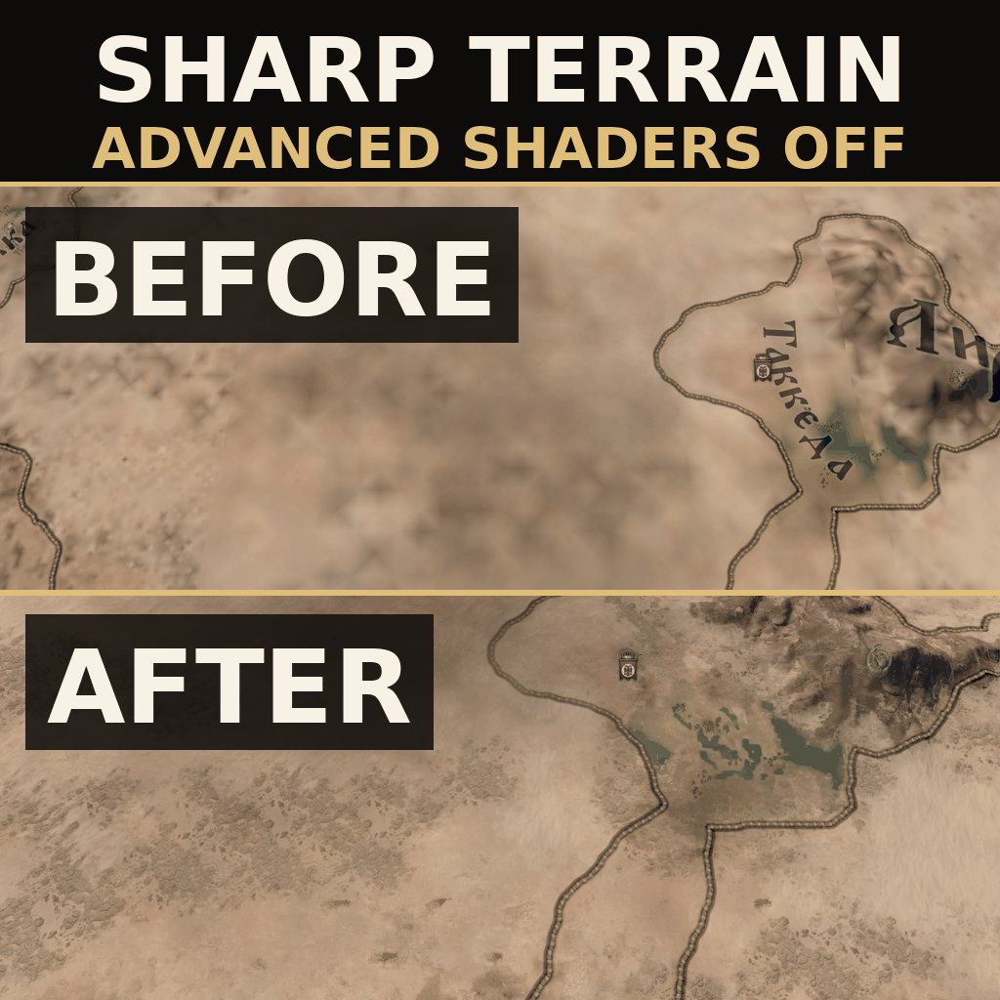

# Sharp Terrain Without Advanced Shaders (CK3)

Restores per-pixel terrain detail textures when the graphics option
**Advanced Shaders** is turned off. Vanilla makes the whole map look like a
blurry watercolour in that mode, regardless of the Texture Quality setting.

**Guide:** [CK3 on a potato PC: a locked 60 FPS, and the map still looks sharp](https://steamcommunity.com/sharedfiles/filedetails/?id=3800254441) - the full settings list this mod is built around.

## Where to get

* [Steam Workshop](https://steamcommunity.com/sharedfiles/filedetails/?id=3800159542)
* [Paradox Mods](https://mods.paradoxplaza.com/mods/158878/Any)

Or build it from this repository - see [Installing](#installing) below.

## Cause

It is not a texture streaming or Texture Quality bug. With Advanced Shaders off
the engine renders the map with `Effect PdxTerrainLowSpec` from
`game/gfx/FX/pdxterrain.shader`, and that effect does the detail texture work in
the **vertex** shader:

    VS_OUTPUT_PDX_TERRAIN_LOW_SPEC TerrainVertexLowSpec( ... )
    {
        ...
        CalculateDetailsLowSpec( Vertex.WorldSpacePos.xz, Out.DetailDiffuse, Out.DetailMaterial );
        Out.ColorMap = ToLinear( PdxTex2DLod0( ColorTexture, ... ).rgb );
        Out.Normal   = CalculateNormal( Vertex.WorldSpacePos.xz );
    }

`DetailDiffuse`, `DetailMaterial`, `ColorMap` and `Normal` are then just
interpolated across each terrain triangle, so the effective ground resolution is
the density of the terrain mesh, not the resolution of the textures. Texture
Quality only controls which mip level gets loaded - the textures are loaded at
full resolution, they are simply sampled once per vertex and smeared.

The high spec `PixelShader` calls `CalculateDetails()` per pixel instead, which
is why turning Advanced Shaders on looks sharp.

## Fix

`gfx/FX/pdxterrain.shader` is a copy of the vanilla file with one new pixel
shader, `PixelShaderLowSpecSharp`, and the two low spec effects rewired to it:

    Effect PdxTerrainLowSpec       VertexShaderLowSpec      -> VertexShader
                                   PixelShaderLowSpec       -> PixelShaderLowSpecSharp
    Effect PdxTerrainLowSpecSkirt  VertexShaderLowSpecSkirt -> VertexShaderSkirt
                                   PixelShaderLowSpec       -> PixelShaderLowSpecSharp

`PixelShaderLowSpecSharp` is the vanilla low spec pixel shader with the
interpolated inputs replaced by per-pixel work:

* `CalculateDetails()` per pixel, with `ddx`/`ddy` driven mip selection, instead
  of the per-vertex `CalculateDetailsLowSpec()` and its `PdxTex2DLod0` sampling
* colormap and terrain normal sampled per pixel
* detail normal maps applied via `ReorientNormal()` - `CalculateDetails()`
  samples them anyway, so this is free; comment that line out for the flat
  vanilla low spec look

Because the effects now use the plain `VertexShader`, the per-vertex detail
sampling is gone entirely, which claws back part of the added pixel cost.

Everything that actually makes Advanced Shaders expensive is still off:
no shadow map lookups, no cloud shadows, no province effects (snow, drought,
flooding), no cubemap/IBL, no overcast contrast, and the cheap
`CalculateTerrainSunLightingLowSpec()` sun lighting. Expect it to land between
vanilla low spec and Advanced Shaders on, much closer to low spec.

Only the terrain is touched. Water, rivers, trees, meshes and the surround map
keep their vanilla low spec variants.

## Zoomed out: skipping terrain nobody can see

From `NTerrainCulling.REALM_COLOR_MAP_FULLY_ZOOM_STEP` (zoom step 15) outwards
the realm colour overlay is fully opaque and the terrain under it contributes
nothing to the frame. Vanilla already knows this and gates the sun lighting
and the fog on `!IsFullyColorOverlay`, but it still samples the colormap, runs
`CalculateNormal` (four heightmap taps) and `ApplyDynamicMasksDiffuse` (four
snow-mask taps) and discards the result - and the per-pixel `CalculateDetails`
this mod adds would be discarded with it.

`#define TERRAINOPT_SKIP_HIDDEN_TERRAIN`, at the top of the `PixelShader`
`Code` block, guards an early out that returns the overlay directly in that
case. It reproduces the vanilla tail exactly, including the
`TERRAIN_FLAT_MAP_LERP` ordering where the Lerp variant overwrites
`BorderPostLightingBlend` before it is used, so **the output is bit identical**
- the only thing that changes is the work that was being thrown away. Comment
the define out to go back to the previous behaviour.

The overlay itself is still not cheap: once it is on, every terrain pixel pays
roughly 39 texture fetches for the province colours, the border distance field
and the highlight layer (`BilinearColorSample` is four indirection lookups plus
four loads, and there are three of those, plus a five-tap distance field). That
is unchanged here.

The *hitches* while crossing zoom thresholds are a separate problem with a
separate cause, and live in
[Smooth Zoom Transitions](https://github.com/mekedron/ck3-zoom-transition-fix).

## Options and add-ons

The shader's optional features are switched from one small file,
`gfx/FX/sharp_terrain_options.fxh`, which the shader includes first. The base mod
ships it with everything commented out. An add-on mod that contains only its own copy
of that file, placed **below** Sharp Terrain in the load order, replaces it and turns
an option on without duplicating the shader - the game resolves includes by path
across all mods, and the lowest mod wins.

| option | what it does | add-on |
| --- | --- | --- |
| `TERRAINOPT_SNOW_MATERIAL` | the high spec snow material (height blend, normals, roughness, frost) instead of the flat procedural low spec snow; about 4 ms of frame time in winter at 5120x1440 on a 3050 Ti Laptop | [Real Snow Without Advanced Shaders](https://github.com/mekedron/ck3-lowspec-real-snow) |

You can also uncomment the define in the base mod's own file, of course.

## A Game of Thrones

The AGOT total conversion ships its own `pdxterrain.shader` and rewrites the include
files it shares with this one (its snow functions take extra arguments, the fog of war
is replaced by an atmospheric pass). With AGOT below this mod in the load order AGOT's
file wins and this mod does nothing; with AGOT above it this file is compiled against
AGOT's includes, fails, and the terrain is not drawn. Use
[Sharp Terrain & Better Water: A Game of Thrones Patch](https://github.com/mekedron/ck3-lowspec-agot-patch) below both; it is
AGOT's shader with this mod's low spec path applied on top, and Real Snow works through
it unchanged.

## Layout

    descriptor.mod              mod metadata (read from inside the mod dir)
    thumbnail.png               Workshop preview image, must sit in the mod root
    gfx/FX/pdxterrain.shader    overrides game/gfx/FX/pdxterrain.shader
    gfx/FX/sharp_terrain_options.fxh   the option switches, overridable by add-ons
    install.sh                  copies the mod into the Proton prefix
    tools/compile_check.py      offline compile check with DXC (see the file's docstring)
    tools/check_log.sh          mount + shader error check after a game start
    tools/diff_vanilla.sh       re-diff against the Steam file after a patch
    steam-workshop/             Workshop listing texts and the thumbnail generator

## Installing

Run `./install.sh`. It copies the mod into the CK3 mod directory **inside the
Proton prefix**:

    ~/.local/share/Steam/steamapps/compatdata/1158310/pfx/drive_c/users/steamuser/
      Documents/Paradox Interactive/Crusader Kings III/mod/

That is the path the game and the Paradox launcher actually use under Proton.
`~/.local/share/Paradox Interactive/Crusader Kings III` is the native-Linux
location and is *not* read by the Proton build.

Close the launcher before installing, then start it and enable
"Sharp Terrain Without Advanced Shaders" in the playset.

`install.sh` only places the files; it cannot add the mod to a playset, because
that lives in the launcher's own `launcher-v2.sqlite`. A freshly installed mod
shows up in the launcher's mod list but is **not** enabled until you tick it in
the playset - until then the game loads without it and nothing changes on screen.
`dlc_load.json` next to the mod directory lists what was actually enabled on the
last launch, which is the quickest way to check.

Keep **Advanced Shaders off** in Graphics settings - with it on the game uses
`PdxTerrain`/`PixelShader` and the mod does nothing.

Compiled shaders are cached under `<prefix documents>/Crusader Kings III/shadercache`,
keyed by a hash of the shader source, so the modded shader gets fresh cache
entries by itself. The first load after installing is slower. If the map somehow
still looks unchanged, delete that directory (~900 MB, the game rebuilds it).

## Game version

Built against 1.19.0.6 (Scribe). Shader overrides fully replace the vanilla
file, so after a game patch re-diff `gfx/FX/pdxterrain.shader` against
`<steam>/Crusader Kings III/game/gfx/FX/pdxterrain.shader`. The vanilla
`VertexShaderLowSpec` / `PixelShaderLowSpec` blocks are deliberately left in the
file, unreferenced, to make that diff readable.

## Multiplayer / achievements

Shader files are not checksummed content, but the launcher still marks any mod
as a mod. Treat it like any other graphics mod.
